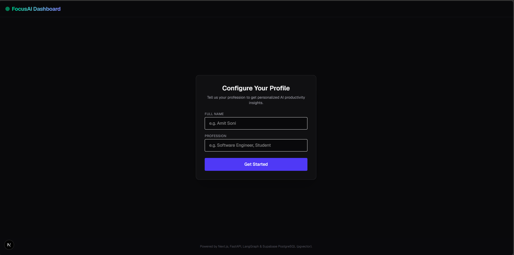

# FocusAI - Full-Stack AI Productivity & Focus Analyzer

FocusAI is a modern, end-to-end full-stack application designed to analyze daily activity logs based on the user's profession. It determines productivity metrics (productive vs. wasted hours, overall rating), triggers an AI Agent to dynamically search for productivity solutions if distractions are detected, and stores historical reports in a vector database for semantic searching.

---

## 📸 Screenshots

### 1. User Profile Setup Screen


### 2. Today's Activity Logger Workspace


### 3. AI-Generated Coaching Report & Metrics Dashboard


---

## 🏗️ System Architecture & Flow

For a detailed step-by-step flowchart and visual sequence diagrams, see:
* **System Architecture**: [architecture_diagram.md](architecture_diagram.md)
* **Registration Flow**: [profile_creation_flow.md](profile_creation_flow.md)
* **AI Analysis Flow**: [activity_analysis_flow.md](activity_analysis_flow.md)

---

## 🛠️ Tech Stack

* **Frontend**: Next.js (React & TypeScript) & Tailwind CSS
* **Backend**: FastAPI (Python) & Uvicorn server
* **AI & Orchestration**: LangGraph (LangChain) & Groq API (Llama-3-70b-versatile)
* **Tools**: DuckDuckGo Search API
* **Embeddings**: HuggingFace Sentence Transformers (`all-MiniLM-L6-v2` - 384 dimensions)
* **Database & Vector Store**: Supabase (PostgreSQL with `pgvector`)

---

## 🚀 Getting Started

### 1. Database Setup (Supabase)
Login to your Supabase Dashboard, open the **SQL Editor**, create a new query, and run the following commands to create the tables and the vector similarity search function:

```sql
-- 1. Enable vector extension
create extension if not exists vector;

-- 2. Create profiles table
create table if not exists profiles (
    id uuid default gen_random_uuid() primary key,
    name text not null,
    profession text not null,
    created_at timestamp with time zone default timezone('utc'::text, now()) not null
);

-- 3. Create productivity logs table
create table if not exists productivity_logs (
    id uuid default gen_random_uuid() primary key,
    profile_id uuid references profiles(id) on delete cascade,
    log_date date default current_date not null,
    raw_log text not null,
    productive_hours numeric not null,
    wasted_hours numeric not null,
    score numeric not null,
    report_content text not null,
    embedding vector(384),
    created_at timestamp with time zone default timezone('utc'::text, now()) not null
);

-- 4. Create semantic search helper function
create or replace function match_logs (
  query_embedding vector(384),
  match_threshold float,
  match_count int,
  p_profile_id uuid
)
returns table (
  id uuid,
  log_date date,
  raw_log text,
  report_content text,
  similarity float
)
language sql stable
as $$
  select
    productivity_logs.id,
    productivity_logs.log_date,
    productivity_logs.raw_log,
    productivity_logs.report_content,
    1 - (productivity_logs.embedding <=> query_embedding) as similarity
  from productivity_logs
  where productivity_logs.profile_id = p_profile_id
  and 1 - (productivity_logs.embedding <=> query_embedding) > match_threshold
  order by productivity_logs.embedding <=> query_embedding
  limit match_count;
$$;
```

---

### 2. Backend Setup
1. Open a terminal in the root directory.
2. Activate your Python virtual environment.
3. Install dependencies:
   ```bash
   pip install -r backend/requirements.txt
   pip install ddgs
   ```
4. Create a `.env` file in the `backend/` directory:
   ```env
   GROQ_API_KEY=your_groq_api_key_here
   SUPABASE_URL=https://your_supabase_project.supabase.co
   SUPABASE_KEY=your_supabase_anon_public_key_here
   PORT=8000
   ```
5. Run the FastAPI backend server:
   ```bash
   python backend/main.py
   ```
   *The server will start on `http://localhost:8000`. You can access interactive documentation at `http://localhost:8000/docs`.*

---

### 3. Frontend Setup
1. Open a new terminal tab and navigate to the `frontend/` folder:
   ```bash
   cd frontend
   ```
2. Install npm packages:
   ```bash
   npm install
   ```
3. Start the Next.js development server:
   ```bash
   npm run dev
   ```
4. Open your browser and go to `http://localhost:3000`.

---

## 📊 Sample Activity Logs for Testing

You can copy and paste these pre-made 24-hour student schedules into the activity logger to test the AI's evaluations, web search routing, and coaching tips:

### 1. Balanced & Highly Productive Schedule (Expected Rating: 85% - 95%)
```text
07:00 to 08:00 - Woke up, had breakfast and did light stretching.
08:00 to 13:00 - Attended school classes and paid attention.
13:00 to 14:00 - Lunch break and rested.
14:00 to 15:00 - Used mobile phone to check messages and watch educational tutorials.
15:00 to 17:30 - Attended coaching classes for Physics and Chemistry.
17:30 to 19:00 - Went to the playground and played football with friends (outdoor exercise).
19:00 to 20:00 - Showered and had dinner.
20:00 to 22:30 - Focused self-study (solved physics problems and completed homework).
22:30 to 23:00 - Quick phone check and read a book chapter.
23:00 - Slept.
```

### 2. Distracted & Unproductive Schedule (Expected Rating: 30% - 50%)
```text
09:00 to 10:00 - Woke up late, stayed in bed scrolling Instagram and playing BGMI on phone.
10:00 to 13:00 - Skiped online school classes and watched anime instead.
13:00 to 14:00 - Lunch and scrolled Reels on phone.
14:00 to 15:30 - Felt lazy, took a long afternoon nap.
15:30 to 17:30 - Skiped coaching classes to play computer games.
17:30 to 19:30 - Went to the playground but just sat on a bench scrolling YouTube shorts on my phone.
19:30 to 21:00 - Dinner and chatted with friends on Snapchat.
21:00 to 23:00 - Sat with books to study but checked phone notifications every 10 minutes. Solved only one math problem in 2 hours.
23:00 to 01:00 - Played mobile games in bed before sleeping.
```

### 3. Average & Semi-Productive Schedule (Expected Rating: 65% - 75%)
```text
07:30 to 08:30 - Woke up, had breakfast, and spent 15 minutes scrolling phone.
08:30 to 13:30 - Attended school lectures, but got bored and lost focus in the last class.
13:30 to 14:30 - Lunch break and scrolled Instagram reels for 30 minutes.
14:30 to 15:30 - Tried to do self-study, but spent half of the time chatting with friends on WhatsApp.
15:30 to 17:30 - Attended coaching classes for Math and Chemistry.
17:30 to 19:00 - Went to the playground and played cricket with friends (good outdoor hobby).
19:00 to 20:00 - Showered and had dinner while watching YouTube videos.
20:00 to 21:00 - Completed coaching homework and revised chemistry notes.
21:00 to 22:00 - Played mobile games with friends.
22:00 to 22:30 - Revised formulas for tomorrow's classes.
22:30 to 23:00 - Checked social media in bed.
23:00 - Slept.
```

### 4. Average & Semi-Productive Schedule (Expected Rating: 65% - 75%)
```text
play 3 hours
study 5 hours
sleep 8 hours
gym 1 hour
mobile 1 hour
2 hours friends hangout
2 internet surfing 
2 hours travelimg
```

---

## 🔮 Future Enhancements
* **Dedicated Vector DB**: Scale to Pinecone or Qdrant for large-scale document caching.
* **Token Streaming**: Integrate Vercel AI SDK to stream coaching reports word-by-word.
* **Semantic History QA**: Implement a chat interface to ask questions about past productivity logs using RAG search.
