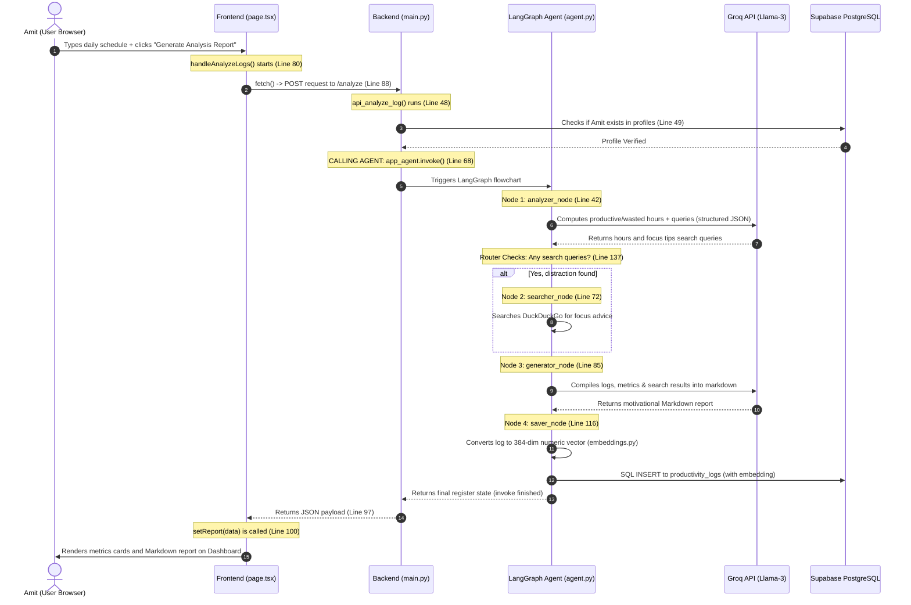

# FocusAI - Daily Activity Log & Agent Workflow Flowchart

This document contains a step-by-step explanation and visual diagram of the daily activity log analysis flow, including our LangGraph AI Agent's execution.

---

## 1. Flow Diagram (Sequence Chart)

---

## 2. Step-by-Step Code Walkthrough

### Step 1: Frontend Submission
* **File:** [page.tsx](file:///e:/ai_agent_in_python/frontend/app/page.tsx#L80-L109)
* **Code:** `handleAnalyzeLogs`
* **Why:** Frontend sends user's textarea string, profession, and profile_id over the internet to `/analyze`.

### Step 2: Backend Check & Invoke Agent
* **File:** [main.py](file:///e:/ai_agent_in_python/backend/main.py#L48-L79)
* **Code:** `api_analyze_log`
* **Why:** Backend verifies the profile in database, prepares a fresh dictionary (register), and kicks off the AI workflow using **`app_agent.invoke(state_input)`**.

### Step 3: LangGraph Agent Steps
* **File:** [agent.py](file:///e:/ai_agent_in_python/backend/agent.py)

1. **`analyzer_node` (Line 42)**: Uses Groq to split schedule into productive and wasted hours. It also registers search keywords if distractions are present.
2. **`router` (Line 137)**: Evaluates the register. If search queries are present, it redirects to the `searcher`, otherwise directly to the `generator`.
3. **`searcher_node` (Line 72)** (Conditional): Executes DuckDuckGo API to extract focus suggestions online.
4. **`generator_node` (Line 85)**: Compiles all information and uses Groq to write the final motivational markdown coaching report.
5. **`saver_node` (Line 116)**:
   - Transforms raw log text into vector numbers via `embeddings.py` (HuggingFace cache).
   - Writes the full row entry to the `productivity_logs` database table.

### Step 4: Frontend Presentation
* **File:** [page.tsx](file:///e:/ai_agent_in_python/frontend/app/page.tsx#L100)
* **Code:** `setReport(data)`
* **Why:** React detects the state change, stops the loading spinner, and displays the final productivity cards and AI deep dive report on the user dashboard.
