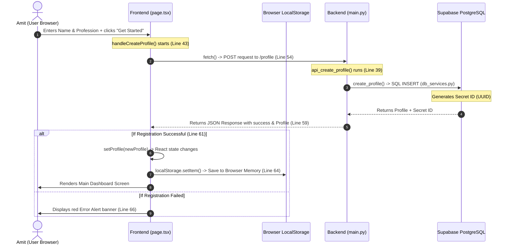

# FocusAI - Profile Registration Flow Diagram

This document contains a step-by-step explanation and visual diagram of the profile creation flow (user registration) in our application.

---

## 1. Flow Diagram (Sequence Chart)

---

## 2. Step-by-Step Code Walkthrough

### Step 1: The Trigger (Frontend)
* **File:** [page.tsx](file:///e:/ai_agent_in_python/frontend/app/page.tsx#L43-L71)
* **Code:** `handleCreateProfile`
* **What happens:** 
  1. The user types their name and profession, then clicks the button.
  2. `e.preventDefault()` halts the default HTML form action (preventing page refresh).
  3. `fetch()` sends a JSON packet containing `{ name, profession }` to `http://localhost:8000/profile`.

### Step 2: The Gateway (Backend)
* **File:** [main.py](file:///e:/ai_agent_in_python/backend/main.py#L38-L45)
* **Code:** `api_create_profile`
* **What happens:**
  1. FastAPI receives the request and validates the input using the `profileRequest` schema.
  2. It calls the database service: `create_profile(name, profession)`.

### Step 3: Database Insertion (Supabase)
* **File:** [db_services.py](file:///e:/ai_agent_in_python/backend/db_services.py#L3-L16)
* **Code:** `create_profile`
* **What happens:**
  1. The code connects to Supabase database client.
  2. It executes an INSERT query on the `profiles` table.
  3. Supabase saves the row, creates a unique UUID (Secret ID), and returns the new row details.

### Step 4: Storing the ID & Screen Shift (Frontend state)
* **File:** [page.tsx](file:///e:/ai_agent_in_python/frontend/app/page.tsx#L61-L64)
* **What happens:**
  1. The frontend receives the JSON response.
  2. **`setProfile(newProfile)`** updates the state. React detects this and swaps the Profile Form with the Dashboard view.
  3. **`localStorage.setItem(...)`** writes the credentials to the browser's persistent sandbox memory so the user stays logged in next time.
